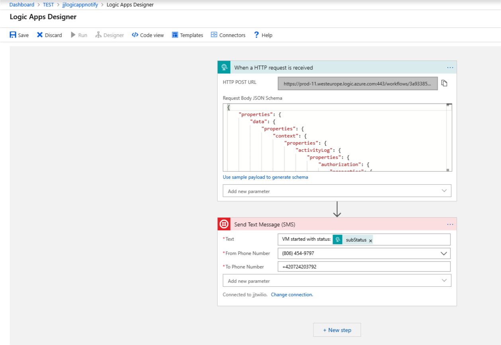
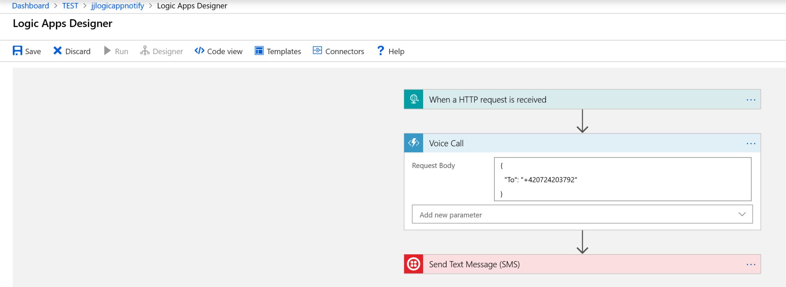
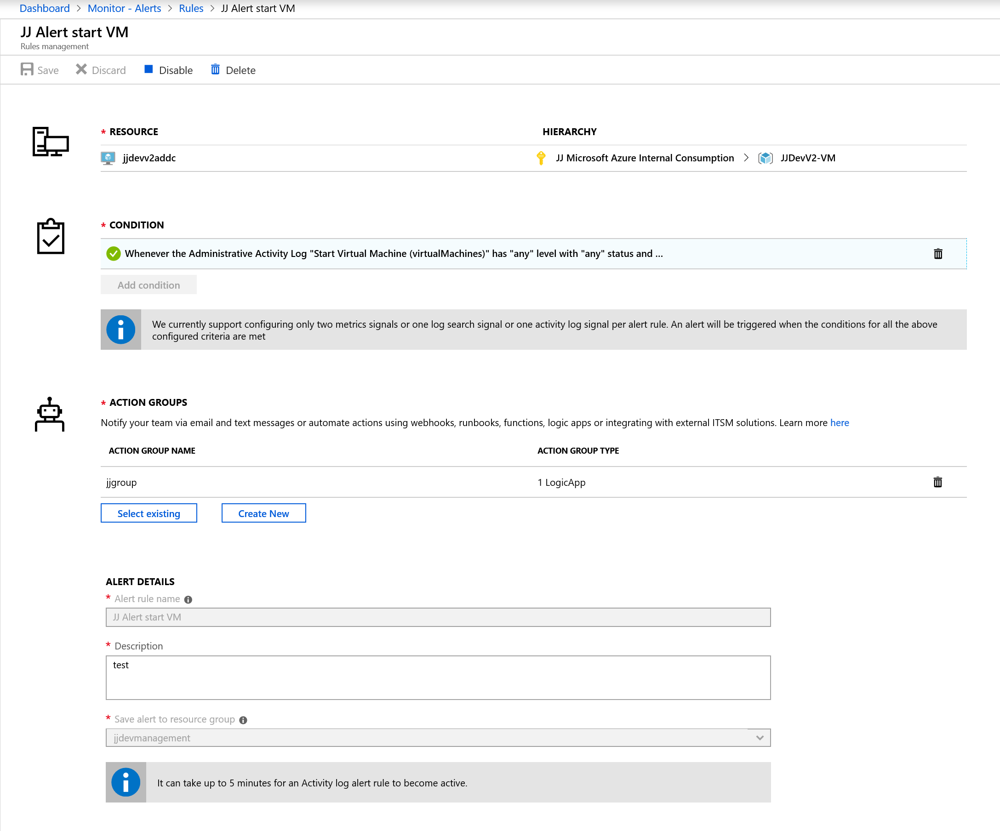
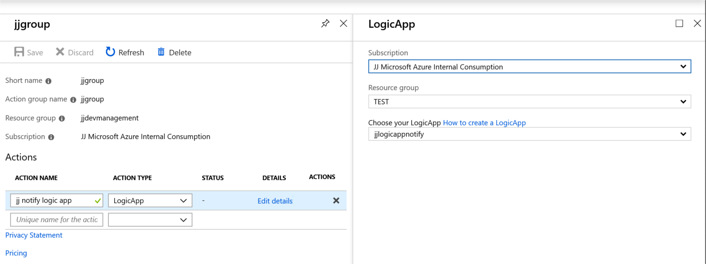

# JJAzure Twilio sample

Twilio is 3rd party service to send/receive SMS and voice calls 

## Register Twilio service

Browse Trial account - https://www.twilio.com/docs/usage/tutorials/how-to-use-your-free-trial-account

Next create follow this steps

- buy new phone number (check that supports SMS and voice)
- check console https://www.twilio.com/console and get access credentials

## Send SMS with Azure LogicApp

Create new Azure LogicApp flow

- add new Twilio action - enter access credentials
- add From phone number, like (806) 454-9797
- add To phone number, like +420123456789
- add Text message - combine with data received in event

## Send Voice Call with LogicApp

Current version of Twilio connector in Azure LogicApp not allow Voice Call action. First you have to prepare Azure Function to process Voice Call.

Twilio [tutorial](https://www.twilio.com/docs/voice/quickstart/csharp?code-sample=code-make-an-outgoing-call-using-twilio-and-c&code-language=C%23&code-sdk-version=5.x)

We have to crete two functions

- Function to fire Voice Call - twilio-call
- Function to return XML response definition - twilio-call-response

*Note: XML response must be served as POST request and return ContentType text/xml*

There are two implementations on Azure Function ([check differences](https://docs.microsoft.com/en-us/azure/azure-functions/functions-versions))

- folder src - contains Functions v1 (C# script .csx)
- folder src-v2 - contains Functions v2 (C# class library)

Next add new Action in **Azure LogicApp - add new Function** - just to select correct function\

## Connect to Azure Monitor

To be able consume alert data in Azure LogicApp flow you have to fire event and capture payload in LogicApp. 
Insert payload into LogicApp HttpTrigger and it creates new schema.

**Alert definition, e.g. VM has been started**

**Alert Action Group - send to LogicApp**
